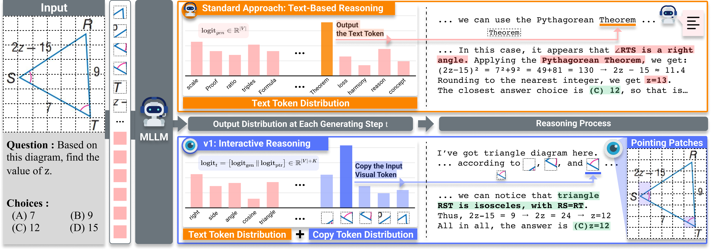
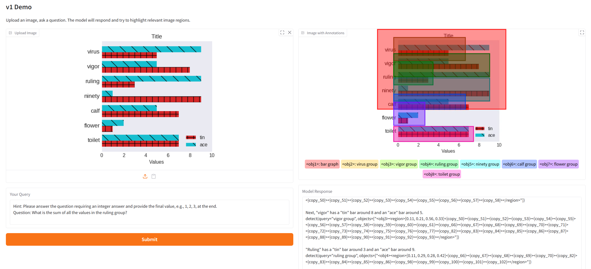

# Don't Look Only Once: Towards Multimodal Interactive Reasoning with Selective Visual Revisitation  

<p align="left">
    <a href='https://jiwanchung.github.io/' target='_blank'>Jiwan Chung<sup>*</sup></a>&emsp;
    <a href='https://junhyeok.kim/' target='_blank'>Junhyeok Kim<sup>*</sup></a>&emsp;
    <a href='https://scholar.google.com/citations?user=w3hOuRoAAAAJ' target='_blank'>Siyeol Kim</a>&emsp;
    <a href='https://jaeyoung-l.github.io/' target='_blank'>Jaeyoung Lee</a>&emsp;
    <a href="https://scholar.google.com/citations?user=Og3gN_AAAAAJ" target='_blank'>Minsoo Kim</a>&emsp;
    <a href='https://mirlab.yonsei.ac.kr/' target='_blank'>Youngjae Yu</a>
</p>

[](https://arxiv.org/abs/2505.18842) 
[](https://huggingface.co/kjunh/v1-7B) 
[](https://huggingface.co/datasets/kjunh/v1g-sample)


<p align="center">
  
</p>

## Installation
```bash
conda create -n v1 python=3.10 -y
conda activate v1
pip install -r requirements.txt
pip install flash-attn --no-build-isolation
```

## Demo

### Gradio Web UI
Highly Recommended as the copy tokens are displayed on image.

<p align="center">
  
</p>

```bash
python run_gradio.py
```

### Inference
```bash
python inference.py
```
The script uses a default image URL and text prompt. To use your own inputs, you can modify the `image` variable within the `messages` list and the `text` field for the user prompt.

## Data
We have released a [100-item sample of our v1g dataset](https://huggingface.co/datasets/kjunh/v1g-sample) on the Hugging Face Hub. You can load it easily using the `datasets` library:

```python
from datasets import load_dataset

ds = load_dataset("kjunh/v1g-sample")
```

## Coming Soon
- [x] Inference code
- [x] Training data sample
- [ ] Training data
- [ ] Evaluation code
- [ ] Training code


## Citation
If you find our work valuable, please cite:
```bibtex
@misc{chung2025dontlookoncemultimodal,
      title={Don't Look Only Once: Towards Multimodal Interactive Reasoning with Selective Visual Revisitation}, 
      author={Jiwan Chung and Junhyeok Kim and Siyeol Kim and Jaeyoung Lee and Min Soo Kim and Youngjae Yu},
      year={2025},
      eprint={2505.18842},
      archivePrefix={arXiv},
      primaryClass={cs.CL},
      url={https://arxiv.org/abs/2505.18842}, 
}
```