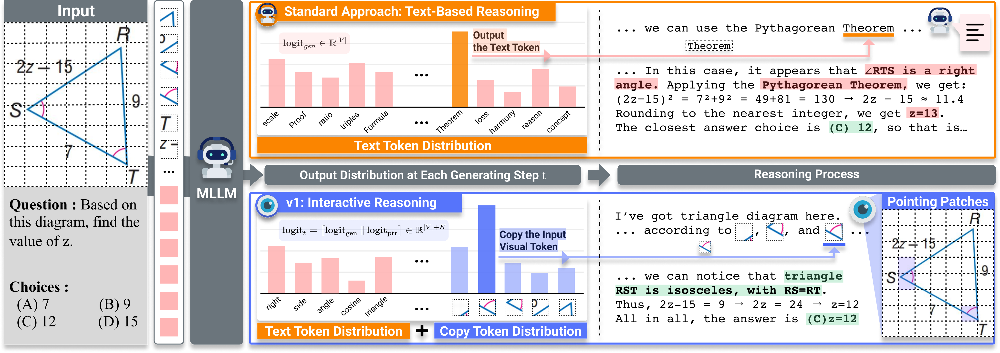
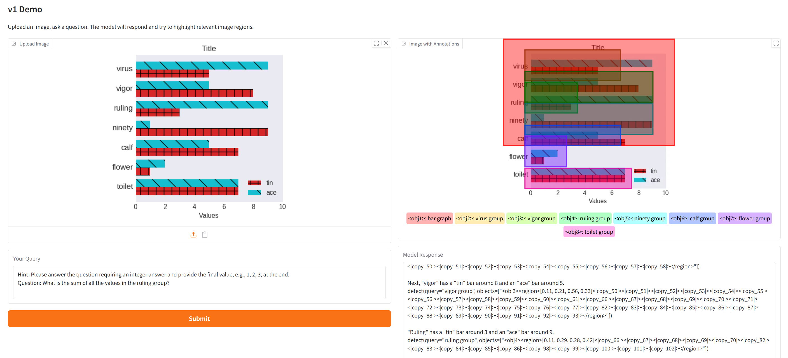

# v1: Learning to Point Visual Tokens <br> for Multimodal Grounded Reasoning

<p align="left">
    <a href='https://jiwanchung.github.io/' target='_blank'>Jiwan Chung<sup>*</sup></a>&emsp;
    <a href='https://junhyeok.kim/' target='_blank'>Junhyeok Kim<sup>*</sup></a>&emsp;
    <a href='https://scholar.google.com/citations?user=w3hOuRoAAAAJ' target='_blank'>Siyeol Kim</a>&emsp;
    <a href='https://jaeyoung-l.github.io/' target='_blank'>Jaeyoung Lee</a>&emsp;
    <a href="https://scholar.google.com/citations?user=Og3gN_AAAAAJ" target='_blank'>Minsoo Kim</a>&emsp;
    <a href='https://mirlab.yonsei.ac.kr/' target='_blank'>Youngjae Yu</a>
</p>

[](https://arxiv.org/abs/2505.18842) 
[](https://huggingface.co/kjunh/v1-7B) 
[](https://huggingface.co/datasets/kjunh/v1g)

🎉 **v1 is accepted at COLM 2026!**


<p align="center">
  
</p>

## Installation
```bash
conda create -n v1 python=3.10 -y
conda activate v1
pip install -r requirements.txt
pip install flash-attn --no-build-isolation
```

## Demo

### Gradio Web UI
Highly Recommended as the copy tokens are displayed on image.

<p align="center">
  
</p>

```bash
python run_gradio.py
```

### Inference
```bash
python inference.py
```
The script uses a default image URL and text prompt. To use your own inputs, you can modify the `image` variable within the `messages` list and the `text` field for the user prompt.

## Data
The full [v1g dataset](https://huggingface.co/datasets/kjunh/v1g) (~300K multimodal reasoning traces with interleaved grounding annotations) is available on the Hugging Face Hub, along with a small [100-item sample](https://huggingface.co/datasets/kjunh/v1g-sample) for quick browsing:

```python
from datasets import load_dataset

ds = load_dataset("kjunh/v1g")
```

Each Parquet row contains the embedded image, ShareGPT-style `human`/`gpt`
`conversations`, and the corresponding grounding `regions`.

## Training

Install the training extras on top of the base requirements:
```bash
pip install -r requirements-train.txt
```

The trainer loads the Parquet dataset directly from the Hub. Hugging Face caches
the downloaded shards locally; set `HF_HOME` if the cache should live on a
specific scratch disk.

Launch training (8×GPU with DeepSpeed ZeRO-3, the configuration used for the released v1-7B):
```bash
bash train.sh
```
Single-GPU debug run:
```bash
python train.py --debug --max_steps 3 --batch_size 1
```

**Reproducibility notes**
- The released `v1-7B` checkpoint was trained with `transformers==4.50.0` (the pin in `requirements-train.txt`); newer versions may not be compatible with the bundled `v1/` modeling code.
- Effective hyperparameters of the released run: lr 3e-5 (linear schedule, warmup ratio 0.03), per-device batch 2 × grad-accum 4 × 8 GPUs, bf16, gradient checkpointing, max grad norm 0.5, `z_loss_weight 1e-5`, max sequence length 8192, images capped at 672px (longer side).
- Data ordering of the released run corresponds to the HF Trainer default shuffling seed (42), independent of the `--seed` flag value used at launch time.

## Release status
- [x] Inference code
- [x] Training data sample
- [x] Training data
- [x] Training code

## License
This project is released under the [Apache License 2.0](LICENSE).

## Citation
If you find our work valuable, please cite:
```bibtex
@misc{chung2025v1learningpointvisual,
      title={v1: Learning to Point Visual Tokens for Multimodal Grounded Reasoning}, 
      author={Jiwan Chung and Junhyeok Kim and Siyeol Kim and Jaeyoung Lee and Min Soo Kim and Youngjae Yu},
      year={2025},
      eprint={2505.18842},
      archivePrefix={arXiv},
      primaryClass={cs.CL},
      url={https://arxiv.org/abs/2505.18842}, 
}
```
(The COLM 2026 proceedings BibTeX will replace this arXiv entry once available.)
